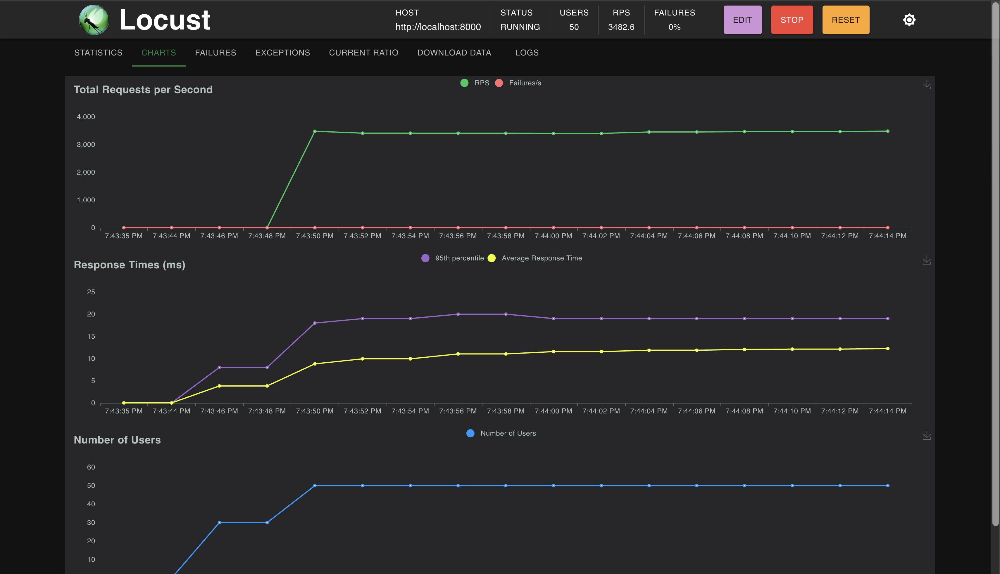

# Fastapi-service

A dummy **FastAPI** ASGI service utilizing:
- Python
- FastAPI + Uvicorn ASGI server
- PostgreSQL + psycopg for async DB access over a connection pool
- Docker & docker-compose
- Pytest, pytest-asyncio, HTTPX for unit, integration and api tests
- Locust for performance testing
- Black, Flake8, pre-commit, make
- Pydantic

# How to run locally

## Install dependencies

`pip install -r requirements.txt`

## Initialize the pre-commit hook

The git hook automatically formats the code using the black formatter on every commit. Install the git hook using:
`pre-commit install `

## Run your PostgreSQL database server

You can run your own server locally or run `make run-postgres-background` to deploy a postgresql
container using docker-compose.

To generate dummy data, run

# Configuration: Initialize your environment variables

Create a file `.env` inside the `/src` directory and set the following env variables. Do not push this file into the
repository!

- POSTGRES_DB_HOST
- POSTGRES_DB_NAME
- POSTGRES_DB_USER
- POSTGRES_DB_PASSWORD

Each variable is parsed using the type specified in `src/config.py` to ensure correct type casting.

## Run the server

To run the server locally, use: `make run-server-local`

To run the server inside a docker container, use: `make run-server-docker`

By default, server will run on `127.0.0.1:8000/`.

# Testing

Tests in this repository are spit into 3 directories:

- `test/unit`: Unit tests containing mocked dependencies, covering the edge cases.
- `test/integration`: Integration tests which use a real dependency instead of the mocked one. Example: Method should
  actually insert a row into the PostgreSQL DB.
- `test/api`: Contains API tests using the HTTPX TestClient. No dependencies are mocked in this case as well.

## Running the tests

To run unit tests, use `make run-unit-tests`.

To run integration and API tests, use `make run-integration-tests` and ``make run-api-tests``. These tests deploy their
own PostgreSQL container using docker compose against which the tests will be executed.

# Folder structure

- `.github`: Contains Github workflows definitions.
- `src`: Contains the source code for the server
- `src/scripts`: Contains useful scripts for easier development and testing, as well as database DDL file.
- `src/static`: Contains the static html files for serving.
- `test`: Contains unit, integration and api tests.

## Potential improvements for future

- Circuit breaking, Caching and server replication (Load balancing) could help increase performance.

- Metrics collection & Monitoring using Prometheus and Grafana

- Use Alembic for db migrations

- Structured logging (JSON logs)

# Performance

I have performed a simple Locust test to assess the performance (`locustfile.py`). The service was able to serve 3,5k RPS, fetching a random user from the DB.

- Hardware: M3 Base, 24Gb RAM
- DB contained 10mil rows, indexes on email and id columns
- Service was running in docker composition with a single replica and 1 uvicorn worker
- Test was executing calls to `/user` endpoint with randomized id to prevent PostgreSQL and psycopg from returning cached results
- Test was simulating 50 parallel users.

