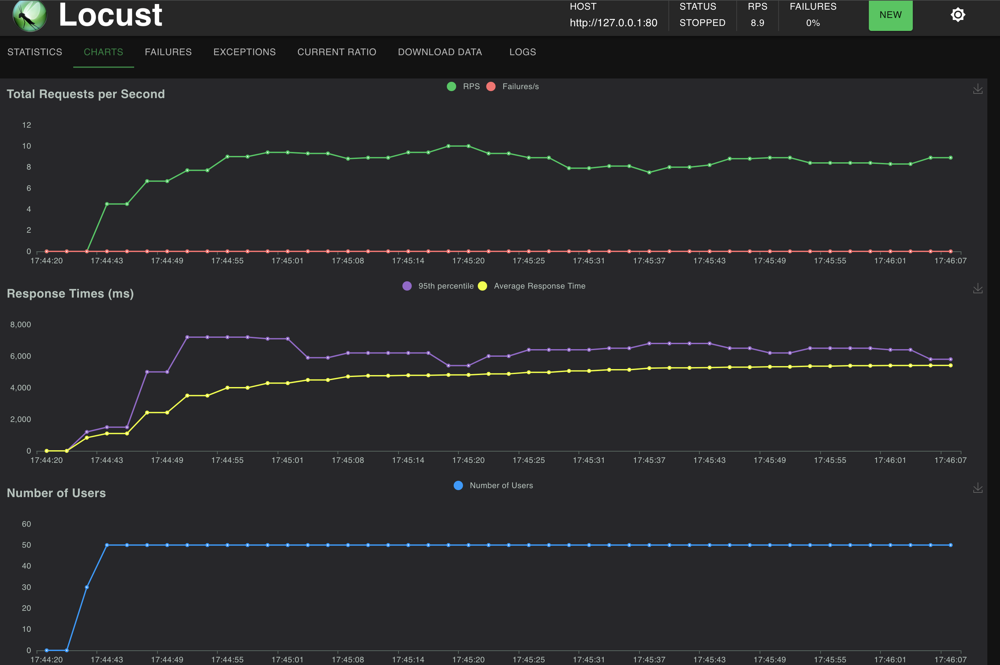
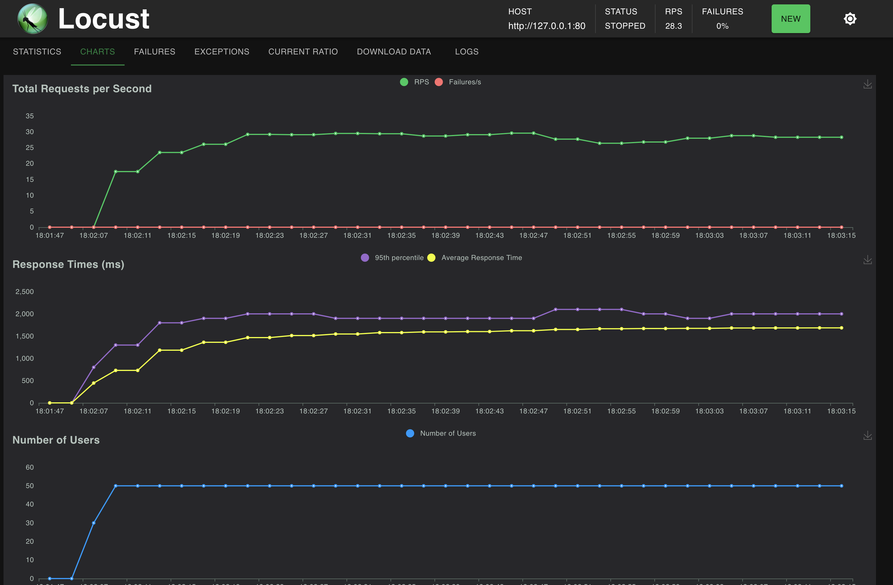

# powerful-medical-assignment

This repository hosts my implementation of the assignment.

# How to run locally

## Install dependencies

`pip install -r requirements.txt`

## Initialize the pre-commit hook

The git hook automatically formats the code using the black formatter on every commit so you don't have to wait for the
CI pipeline just to realize you forgot to format the code :) Install the git hook using:
`pre-commit install `

## Run your PostgreSQL database server

For this purpose you can run your own server locally or run `make run-postgres-background` to deploy a postgresql
container using docker-compose.

# Configuration: Initialize your environment variables

Create a file `.env` inside the `/src` directory and set the following env variables. Do not push this file into the
repository!

- POSTGRES_DB_HOST
- POSTGRES_DB_NAME
- POSTGRES_DB_USER
- POSTGRES_DB_PASSWORD

Each variable is parsed using the type specified in `src/config.py` to ensure correct type casting.

## Run the server

To run the server locally, use: `make run-server-local`

To run the server inside a docker container, use: `make run-server-docker`

By default, server will run on `127.0.0.1:80/`. Static files, including the index page for JSON <-> XML conversion are
being
served at `127.0.0.1:80/static`

# Testing

Tests in this repository are spit into 3 directories:

- `test/unit`: Unit tests containing mocked dependencies, covering the edge cases.
- `test/integration`: Integration tests which use a real dependency instead of the mocked one. Example: Method should
  actually insert a row into the PostgreSQL DB.
- `test/api`: Contains API tests using the HTTPX TestClient. No dependencies are mocked in this case as well.

I'll be happy to adopt your naming conventions and definitions for API/E2E/Integration type of tests as from my
experience, test naming conventions and understanding of what API/E2E/Integration tests are, usually differ from
company to company.

## Running the tests

To run unit tests, use `make run-unit-tests`.

To run integration and API tests, use `make run-integration-tests` and ``make run-api-tests``. These tests deploy their
own PostgreSQL container using docker compose against which the tests will be executed.

# Folder structure

- `.github`: Contains Github workflows definitions.
- `src`: Contains the source code for the server
- `src/scripts`: Contains useful scripts for easier development and testing, as well as database DDL file.
- `src/static`: Contains the static html files for serving.
- `test`: Contains unit, integration and api tests.

## Potential improvements for future

I have indentified the following potential improvements for future. I'd be happy to implement them, but I wanted to
avoid over-engineering without confirming these improvements are needed.

- Read performance of the DB Selects could be improved by creating an index over the email column. Enabling it however
  introduces a penalty when it comes to `INSERT`, `UPDATE` and `DELETE` queries.

- Deletion performance could be improved by implementing soft_deletes and deleting the records in bulk during a
  low-usage period. But again, it introduces trade-offs in terms of memory, foreign key management and more complex
  queries.

- Security issue: Solution does not limit the user input size submitted to the `/json2xml` and `/json2xml` endpoints,
  nor does it sanitize the xml input to protect
  against [common XML vulnerabilities](https://cheatsheetseries.owasp.org/cheatsheets/XML_Security_Cheat_Sheet.html). I
  would use a well-established library for XML parsing if this was a production service.

- Circuit breaking, Caching, Rate-limiting and server replication (Load balancing) could help increase performance.

- Production deployment: I would use gunicorn with uvicorn workers as described
  here: https://fastapi.tiangolo.com/deployment/server-workers/

# Update 21.3.2024 (After submission)

I had some free time today in the evening, so I decided to rewrite the server part in a way that is utilizes the full
async capabilities of psycopg library since we are using an ASGI server.

I have performed a simple Locust test to confirm the performance gain (`locustfile.py`). Test was executed against an
environment which significantly benefits from the async rewrite (slow I/O operations, single worker). During the test,
following criteria applied:

- DB contained 0.5mil rows (not many but enough to demonstrate the performance gain)
- There was intentionally no index over the email column so that the queries are slow
- Test was executing calls to `/users` endpoint with randomized offset parameter to prevent PostgreSQL and psycopg from
  returning cached results
- Test was running against a server running locally with 1 uvicorn worker. This is not a proper production deployment
  setup (see Potential improvements for future) but it is enough for demonstration purposes.
- Test was simulating 50 parallel users.

The benchmark for the synchronous (previous) version looks like the following. 95p response time was around 6s and
throughput around 9RPS.

After the rewrite to async code, 95p response times dropped to 1,7s and throughput increased to 30RPS.

